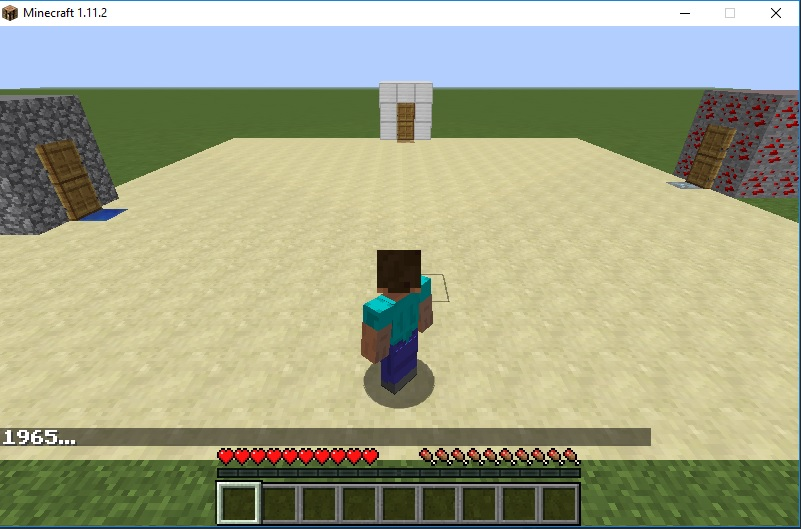

## Project Summary

Our agent, Dashcraft, must deliver food to houses in the most efficient way possible. To do so, it must evaluate the different paths it can take and the different rewards that will result from these combinations of paths. In the beginning, our agent will explore the map and try out different paths, learning which are better along the way. Our goal is for our agent to consistently choose the most efficient path in order to obtain the maximum reward at the end of every run.

## Approach

We used reinforcement learning to train our agent. We utilized a q-table to keep track of our states, actions, and rewards. Our space consisted of 4 states (three houses and the base location) and 4 actions (travel to each of the three houses or return to the base location). Each house had a different alpha value which would help calculate the reward given once it was visited. The rewards would be calculated by multiplying each alpha value by the number of steps our agent has taken then subtracting this value from 50. Therefore, using this formula, houses with a higher alpha value should be visited first since they'll be multiplied by a smaller number of steps, resulting in a higher reward. Also, the agent should combine that decision with considering the path taken to minimize the amount of total steps.

We also evaluated and adjusted the parameters used for our q-table in order to optimize our agent's performance. We made our alpha value (aka learning rate) 0.3 so our agent wouldn't converge too slow and also wouldn't overshoot the minimum. We also made our gamma 1 so future rewards would have more weight since we could train our agent for many iterations and didn't focus as much on immediate results. For our epsilon value, we implemented epsilon decay based on the maximum step count of our agent. We started our epsilon value at 1 so our agent would have the chance to explore the map, then decreased it as the agent's step count started to increase. Therefore, our agent would begin to explore less and make more intelligent decisions the closer it got to the end of its runs.

We used the Bellman equations to choose our action at each state. Every time our agent reached a new state, it evaluated the possible rewards it could gain by choosing a particular action, then chose the action with the maximum reward. The equation used to calculate the reward for each action is as follows:

where q = the current state, a = the chosen action, R = the immediate reward, x = the current run, and gamma = how much we value future rewards vs. current rewards.

After considering all these factors, this was our final algorithm:
1. create and initialize all variables, parameters, and rewards 
2. randomly select the initial state
3. choose next action either based off randomness or maximum reward from this action (determined by epsilon)
4. update q-table based off chosen action and remaining possible states
5. update current state to be chosen state
6. repeat steps 3-6 if the list of possible actions isn't empty

## Evaluation

## Remaining Goals and Challenges

Some of our next goals time permitting:
  * Making the decision process more complex - possibly with deep neural networks
  * Increasing the environment and adding more houses
  * Adding a feature where agent has to come back to "refuel"
    - By decreasing its hearts after every delivery
    - Hearts recharge after agent returns to "distribtion center" at origin
  * Making the environment more interesting by adding roads, obstacles and more
  
Expected Challenges:
  * An environment too large could make decision process inefficient
  * Obstacles could make shortest path problem much harder
  * Unsure about the possibilities of controlling agent's hearts
  
## VIDEO

